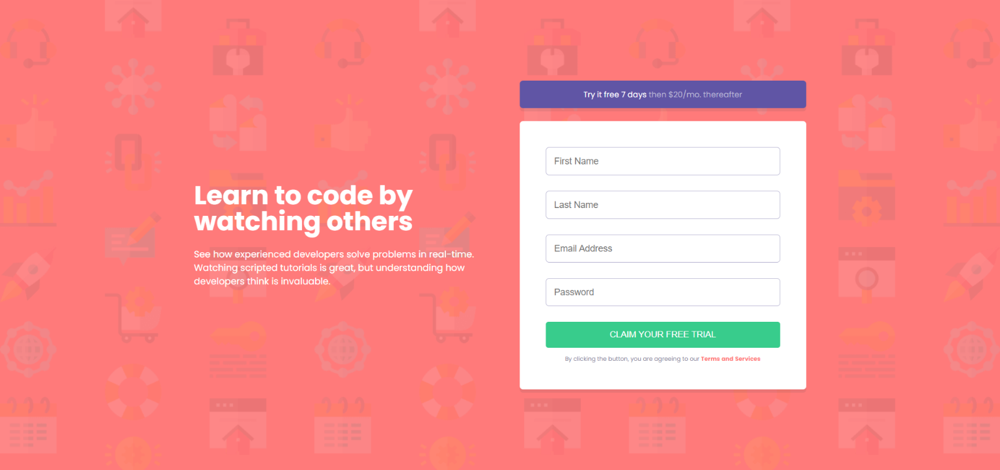

# Frontend Mentor - Intro component with sign up form solution

This is a solution to the [Intro component with sign up form challenge on Frontend Mentor](https://www.frontendmentor.io/challenges/intro-component-with-signup-form-5cf91bd49edda32581d28fd1). Frontend Mentor challenges help you improve your coding skills by building realistic projects.

## Table of contents

- [Overview](#overview)
  - [The challenge](#the-challenge)
  - [Screenshot](#screenshot)
  - [Links](#links)
- [My process](#my-process)
  - [Built with](#built-with)
  - [What I learned](#what-i-learned)
  - [Continued development](#continued-development)
  - [Useful resources](#useful-resources)
- [Author](#author)
- [Acknowledgments](#acknowledgments)

## Overview

### The challenge

Users should be able to:

- View the optimal layout for the site depending on their device's screen size
- See hover states for all interactive elements on the page
- Receive an error message when the `form` is submitted if:
  - Any `input` field is empty. The message for this error should say _"[Field Name] cannot be empty"_
  - The email address is not formatted correctly (i.e. a correct email address should have this structure: `name@host.tld`). The message for this error should say _"Looks like this is not an email"_

### Screenshot

### Links

- Solution URL: [Github](https://github.com/Olixpin/intro-component-with-signup-form-master.com)
- Live Site URL: [signup-form](https://olixpin.github.io/intro-component-with-signup-form-master/)

## My process

### Built with

- Semantic HTML5 markup
- CSS custom properties
- Flexbox
- CSS Grid
- Sass
- Vanila JavaScript
- Desktop-first workflow
- Responsive design
- Accessibility
- Code style

### What I learned

- How to validate form input with vanila js
- How to make use of the className property in vanilla js
- How to use Sass to style your page with variables and mixins
- How to use CSS Grid to layout your page
- How to use flexbox to layout your page
- How to use CSS custom properties to style your page
- How to use responsive design to layout your page
- How to use accessibility to make your page accessible
- How to use code style to make your code readable
- How to use advanced CSS to style your page

### Continued development

Looking forward to validate the form with api calls and integrate it with the backend.

### Useful resources

- [Florin Pop](https://www.youtube.com/watch?v=rsd4FNGTRBw) - I got the idea of how to use icons as error and success message.
- [Free Code Camp](https://www.freecodecamp.org/news/form-validation-with-html5-and-javascript/) - Got some logic to validate my form.

## Author

- Website - [Olix](https://www.your-site.com)
- Frontend Mentor - [@olixpin](https://www.frontendmentor.io/profile/olixpin)
- Twitter - [@olixpin](https://www.twitter.com/olixpin)
- GitHub - [@olixpin](https://www.github.com/olixpin)

## Acknowledgments

I want to thank [Frontend Mentor](https://www.frontendmentor.io/) for creating this challenge. and also [florinpop](https://www.florinpop.com/) for his video, it does help me a lot. You are an amazing tutor. Thank for always helping we the students
